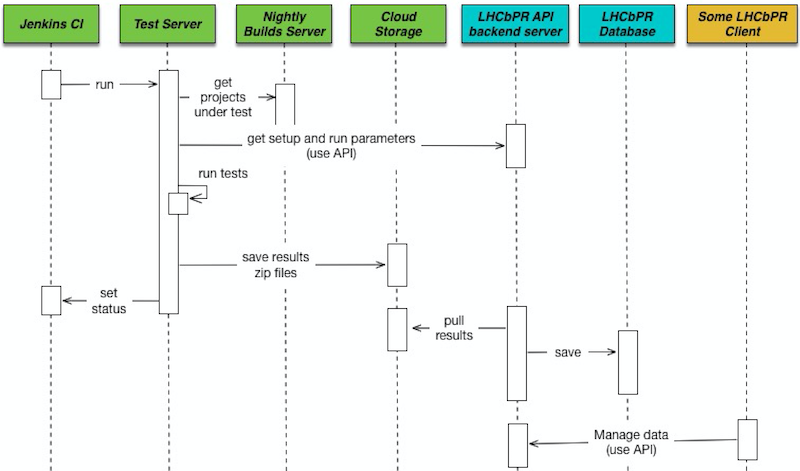

# LHCbPR2 Developers Package

<!-- TOC -->

- [LHCbPR2 Developers Package](#lhcbpr2-developers-package)
    - [Prerequisites](#prerequisites)
        - [Docker](#docker)
        - [Docker Compose](#docker-compose)
    - [Bootstrap](#bootstrap)
    - [Run All Services](#run-all-services)
        - [Run all services in the development environment](#run-all-services-in-the-development-environment)
        - [Run all services in the other environment [optional]](#run-all-services-in-the-other-environment-optional)
    - [Links](#links)
        - [How to run tests without jenkins](#how-to-run-tests-without-jenkins)
        - [How to develop analysis modules](#how-to-develop-analysis-modules)
        - [How services work in production](#how-services-work-in-production)

<!-- /TOC -->

## Prerequisites

* [Git](https://git-scm.com/book/en/v2/Getting-Started-Installing-Git) — to get the lhcbpr2 source
* [Docker](#docker) — to run applications in the same development environment for every user
* [Docker Compose](#docker-compose) — defining and running multi-container Docker applications.


### Docker

> Docker containers wrap a piece of software in a complete filesystem that
> contains everything needed to run: code, runtime, system tools, system
> libraries – anything that can be installed on a server.
> This guarantees that the software will always run the same,
> regardless of its environment.

[Installation instructions for different platforms](https://docker.github.io/engine/installation/)

**Requirements:**
* Docker ≥ 1.10

```sh
# Check docker version
$ docker --version
# Docker version 1.12.3-rc1, build bad4d12, experimental 
```

At linux, It's recommended to add your  user account to the "docker" group, so you can run
docker containers without root rights.

```sh
$ sudo groupadd docker
$ sudo usermod -aG docker $USER
```

Don't forget to verify that you can run docker:
```
$ docker run hello-world
```
If this fails with a message similar to this:
```
Cannot connect to the Docker daemon. Is 'docker daemon' running on this host?
```

### Docker Compose

> Compose is a tool for defining and running multi-container Docker applications.

Compose is preinstalled if you use Docker for Mac or Windows

[Installation instructions](https://docs.docker.com/compose/install/)

**Requirements:**
* docker-compose ≥ 1.8.1


```sh
# Check docker-compose version
$ docker-compose --version
# docker-compose version 1.8.1, build 878cff1
```

## Bootstrap

First, you need to clone this project:

`$> git clone https://gitlab.cern.ch/amazurov/LHCbPR2.git`

, and run bootstrap script

```sh
$> cd LHCbPR2
$> ./scripts/bootstrap
```

, which clone the following subprojects into the `projects` folder:

*  **LHCbPR2BE** - API backend server
*  **LHCbPR2FE** - Web frontend for API server
*  **LHCbPR2ROOT** - Utility server for retreiving information from [root](root.cern.ch) files
*  **LHCbPR2HD** - Prepare jobs output for import into LHCbPR
*  **LbNightlyTools** - Run tests and call handlers from LHCbPR2HD


## Run All Services

### Run all services in the development environment

`docker-compose up -d` 

, runs development environment from `docker-compose.yml` configuration. First run of the command
can take some time.

### Run all services in the other environment [optional]
You can select another environment, by using the following command:

`docker-compose -f <docker-compose-file.yml>  -p <project-name> up -d`

, where **docker-compose-file.yml** and <project-name> can be:

* `docker-compose.dev.yml` and `lhcbpr2dev` - run subprojects in development mode:
    - All changes in the subproject's code immidiately applyed
    - Runs subprojects' internal web servers for debug purposes
* `docker-compose.dev.yml` and `lhcbpr2prod` - run subprojects in mode close to production
    - Runs subprojects' services in production web server: apache, nginx or gunicorn.

**USEFUL:** You can avoid adding `-f` and `-p` options by creating the `.env` file in the root of the project with the following values:
```sh
COMPOSE_PROJECT_NAME=lhcbpr2dev
COMPOSE_FILE=docker-compose.dev.yml
```
(change left values to what you need)

**In the instruction bellow I will ommit -f and -p options for the docker-compose command.**

**IMPORTANT**: if you docker machine url is not `localhost` then change the `APP_HOST` environment in the corresponding compose configuration for `lhcbpr2all` service, e.g:
```
...
lhcbpr2all:
    ...
    environment:
        APP_HOST: your_host_url
        ...
    ports:
        ...
```

After running the command all services should be started and have  **up** state (except lhcbpr2night service):

```
        Name                         Command               State                             Ports
------------------------------------------------------------------------------------------------------------------------------
lhcbpr2dev_lhcbpr2all_1     /usr/local/bin/ep -v /etc/ ...   Up       0.0.0.0:443->443/tcp, 0.0.0.0:80->80/tcp
lhcbpr2dev_lhcbpr2be_1      ./scripts/runserver              Up       0.0.0.0:8082->80/tcp
lhcbpr2dev_lhcbpr2fe_1      ./scripts/runserver              Up       0.0.0.0:35729->35729/tcp, 0.0.0.0:8080->80/tcp, 9000/tcp
lhcbpr2dev_lhcbpr2night_1   /usr/bin/cubied bash             Exit 0
lhcbpr2dev_lhcbpr2root_1    ./scripts/bootstrap              Up       0.0.0.0:8081->80/tcp
```

The other status means that something went wrong and you can investigate the problem in logs:
* Global log for all services: `docker-compose logs -f`
* Log per service: `docker-compose logs -f <service_name>`, e.g.  `docker-compose logs -f lhcbpr2fe`.

When containers are in the "up" state and application are started in the containers (you can see it when logs does not produce
any output) you can access lhcbpr web site at the following address:

[https://localhost/]()

, you need accept unsigned https certificate.


* [docker-compose](https://docs.docker.com/compose/) and [docker](https://docs.docker.com/engine/reference/commandline/cli/) command line documentations.

## Links

### How to run tests without jenkins

Login into lhcbpr2night container with lhcb cvmfs support:
`docker-compose run lhcbpr2night bash`

In the container:
```
mkdir /lhcbprdata/output  # Or any other directory in /lhcbprdata directory
cd /lhcbprdata/output
/app/scripts/lbpr-example # Should produce zip file with job results for LHCbPR
```

At lbpr-example you need to setup your test parameters. [Full documentation](https://gitlab.cern.ch/lhcb-core/LbNightlyTools/blob/lhcbpr2/LHCbPR2.md) at LbNightlyTools repository.

The produced zip result you can import to LHCbPR2BE database:

Login into lhcbpr2be container: `docker-compose exec lhcbpr2be bash`
```
./site/manage.py  lhcbpr_import /lhcbprdata/output
```


### How to develop analysis modules

[LHCBPR2FE](https://gitlab.cern.ch/lhcb-core/LHCbPR2FE)


### How services work in production




* [Jenkins configuration](https://gitlab.cern.ch/lhcb-core/LHCbNightlyConf/blob/master/test_schedule2.xml)
* [Test runner (lhcbpr branch)](https://gitlab.cern.ch/lhcb-core/LbNightlyTools/blob/master/jenkins/testrunners/lhcbpr2.sh)
* [Example of jenkins build](https://lhcb-jenkins.cern.ch/jenkins/job/periodic-slot-tests-poll2/lastBuild/console)
* [Puppet configuration for host machine](https://gitlab.cern.ch/ai/it-puppet-hostgroup-volhcb/blob/qa/code/manifests/lhcbpr.pp)


