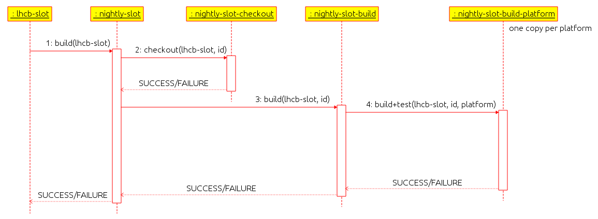

===============================
Nightly Builds Operation Manual
===============================

.. contents:: Table of Contents

Introduction
============
The LHCb Nightly Build System is based on a few subsystems:

- Jenkins_, for scheduling
- custom scripts, for checkout, build and test
- CouchDB_, for the dashboard

Logical organization
--------------------
The LHCb Nightly builds are organized in *slots*, *projects* and *platforms*.

A *slot* is a named set of *projects* meant to test the build of the software
under some well defined conditions.  For example, the slot *lhcb-head* is used
to build the latest version in the repository of all the LHCb software projects
on top of a released version version of Gaudi (and the externals), while
*lhcb-cmake* is used to test the build with CMake of the projects already
converted to it.

A *project* in a *slot* is a well defined version of a LHCb software project,
which could be a *tagged* version (as it can be released) or the latest version
in the repository (using the special version tag `HEAD`). A *project* can also
be tuned by changing the version used for one (or more) of its packages with
respect to the one that is implied by the specified version of the project (for
example use a released version of a package in the `HEAD` version of the project
or vice versa).

Each *project* in each *slot* is built and tested on one or more *platforms*,
i.e. combinations of CPU architecture, Operating System (OS), compiler and
optimization level.  A *platform* is identified by a string where the four parts
of its definition are separated by a `-`, for example `x86_64-slc6-gcc46-opt`
means Intel/AMD (x86) 64 bits architecture, Scientific Linux CERN 6 (SLC6), gcc
4.6.x and optimized build.

Configuration
=============

Scheduling
==========

The scheduling of the nightly builds follows the logical organization, mapped
into Jenkins jobs.

Each configured *slot* must have a corresponding *job* in Jenkins, this job can be enabled or disabled to trigger or not the build of the slot. Usually the slot jobs are run regularly (using the Jenkins *cron trigger*) every morning, but they can be triggered by hand at any moment, for example to pick up changes fixing bugs that caused troubles during the night (note that we can have concurrent builds for a slot).

The slot job triggers the *parameterized job* ``nightly-slot`` passing the job name as argument. ``nightly-slot`` coordinates the actual build phases (checkout, build and test) by triggeting other parameterized job (as shown in the figure below):

 - ``nightly-slot-checkout``: to check out the sources for the build
 - ``nightly-slot-build``: to trigger the actual builds and tests

   Sequence diagram of the jobs controlling the nightly builds in Jenkins.

The parameterized job ``nightly-slot-build`` is a Jenkins *matrix job*, which spawns one sub-job per required platform, which then triggers ``nightly-slot-build-platform`` to actually build and test the slot.

Failures of the jobs infrastructure is propagated from the triggered jobs to the caller ones.  It must be noted that only failures of the Nightly Build System are shown as failures in Jenkins, and failures of the builds or tests are considered succesful run of the Jenkins jobs.

Checkout, Build and Test
========================
**TO-DO**

Dashboard
=========
**TO-DO**

Common Tasks
============

Create a New Slot
-----------------
1. choose the slot configuration style: XML (can use the web-based configuration editor, but not the new features of the build system) or JSON (requires manual editing from a checkout of LHCbNightlyConf_)

2. prepare the configuration of the slot (it is usually a good idea to clone an existing slot configuration and change it)

3. if the build products have to be installed on AFS

  1. create the slot directories and volumes in ``$LHCBNIGHTLIES`` (they can be symlinks to other directories, if needed)
  2. add the slot name to the special file ``slots_on_afs.txt`` in LHCbNightlyConf_

4. create a new *slot job* in Jenkins

  1. go to the `Nightly Builds view`_
  2. click on `New Job <https://buildlhcb.cern.ch/jenkins/view/Nightly%20Builds/newJob>`_ in the menu on the left
  3. use the exact slot name as name of the job
  4. select the option *Copy existing Job* and use `nightly-slot-template` as job to copy from and click on the *OK* button
  5. change the description of the job (it's not used at the moment, but it might be used in the future)
  6. (optionally) enable the slot by un-checking the checkbox *Disable Build*
  7. (optionally) change when the build is started by editing the field *Build periodically/Schedule* (starting the job later in the day will mean that it will have to wait for other builds to complete before being executed)

Stop a Build
------------
Sometimes it is necessary to stop a slot before it completes (for example to restart the builds).

Stop One Platform
~~~~~~~~~~~~~~~~~
If there are pathologic problems with the build of a slot on one platform, or before triggering its rebuild, we can stop it following these steps:

1. go to the `Nightly Builds Dashboard`_
2. locate on the page the slot/platform to stop
3. click on the corresponding Jenkins icon
4. click on the small red square icon with an X at the top right, close to the text *Progress:*

The build will terminate shortly, after some Jenkins internal book keeping operations.

Stop the Whole Slot
~~~~~~~~~~~~~~~~~~~
If the slot is still in the checkout step, stopping the checkout job will be enough:

1. go to the `checkout status page`_
2. identify the running checkout job you want to stop in the list on the left (*Build History*)
3. click on the corresponding red square with an X

If the checkout was completed, you need to stop all the building platforms and the wrapper build job:

1. got to the `platform build status page`_
2. identify the running build jobs you want to stop in the list on the left (*Build History*)
3. click on the corresponding red square with an X
4. go to the `build wrappers status page`_ and repeat steps 2 and 3 (it may not be needed if the builds were terminated quickly enough and if the job is not waiting for some external conditions)

Trigger a Rebuild
-----------------
Re-building can be triggered at different levels:

* full rebuild: new checkout and new build of every platform
* no checkout: keep the existing checkout and rebuild all the platforms
* one platform: rebuild only one platform

Full Rebuild
~~~~~~~~~~~~
This is the easiest option and should be preferred to the others if we can afford the time it takes for a checkout (for slots with several projects it may take more than one hour).

This is also the only option in case we need a fresh checkout.

1. go to the `Nightly Builds view`_
2. click on the schedule icon at the far right corresponding to the slot that need to be triggered
3. (optionally) if you want to override the default list of platforms to build, fill the *platforms* field with a space-separated list of the required platforms
4. click on the *Build* button

The field *os_label* allows you to override the system a build is run on. For example to build *slc5* binaries on a *slc6* machine or to force the build on a specific host. In most cases it must be left empty.

No Checkout
~~~~~~~~~~~
Useful if the checkout of a slot was correct, but all the builds failed for some reason.

1. stop the build of the whole slot following the instructions above
2. go to the `build wrappers status page`_
3. identify the job corresponding to the slot you need to restart and click on its link
4. click on *Rebuild* in the menu on the left
5. click on the *Rebuild* button not modifying the content of the fields

One Platform
~~~~~~~~~~~~
If, for example, there has been a problem with a machine you can rebuild only one platform:

1. stop the build of the platform following the instructions above (`Stop One Platform`_), if needed
2. from the job page, click on *Rebuild* in the menu on the left
3. click on the *Rebuild* button not modifying the content of the fields

Note that you can access the specific build page from the `platform build status page`_ if you cannot find it through the `Nightly Builds Dashboard`_.

Dashboard Database Manipulation
-------------------------------

Remove a Build
~~~~~~~~~~~~~~
In principle there is no need to remove builds from the database, because each new complete build of a slot will be reported in its own table and new partial builds will overwrite the old entries, but sometimes a broken (or aborted) build is just noise in the web page.

1. if you need to remove the current build of the day:
    1. connect to ``buildlhcb.cern.ch`` as *lhcbsoft*
    2. remove the symlink ``/data/artifacts/<slot>/<day>``, where ``<day>`` is the current date as yyyy-mm-dd
2. as *lhcbsoft* set up the environment for the Nightly Build tools
    1. cd ~/LbNightlyTools
    2. source setup.csh
3. start a Python shell and type the following commands (replacing <slot> with the slot name and <build_id> with build numeric id, which can be seen in the URL of the build or tests results)
    1. from LbNightlyTools.Utils import Dashboard
    2. d = Dashboard()
    3. d.dropBuild(<slot>, <build_id>)

Update the Dashboard CouchApp
~~~~~~~~~~~~~~~~~~~~~~~~~~~~~
To update the dashboard CouchApp avoiding downtime of the web page, we need to use a fallback replica.

1. Replicate the dashboard database to a backup instance
    1. connect to http://buildlhcb.cern.ch:5984/_utils/replicator.html (only a few machines can do it)
    2. select the local database ``nightly-builds`` as source and ``nb-backup`` as destination
    3. click on the *Replicate* button and wait
2. Ensure that the views' caches of the backup database are up to date
    1. go to http://buildlhcb.cern.ch:5984/_utils/database.html?nb-backup
    2. select all the views, one by one, in the dropdown list (each view will take some time to be cached)
3. Repeat step 1 to ensure that the most recent data is replicated to the backup copy
4. Redirect the dashboard web page traffic to the backup database
    1. edit ``/etc/httpd/conf.d/couchdb.conf`` replacing  ``nightly-builds`` with ``nb-backup``
    2. (as root) call ``service httpd reload``
5. Update/modify the Dashboard CouchApp in the main database
6. Regenerate the views' caches of the main database
    1. go to http://buildlhcb.cern.ch:5984/_utils/database.html?nightly-builds
    2. select all the views, one by one, in the dropdown list (each view will take some time to be cached)
7. Replicate new documents from the backup instance to the main one
    1. same as step 1, but swapping source and target
    2. check for conflicts
8. Restore the original web page configuration (see step 4)
9. Replicate once more from the backup instance to the main one (see step 7)

*Note*: The replication an the view caching may take a lot of time, unless the are performed regularly (less data to copy/cache).

.. _Jenkins: http://jenkins-ci.org/
.. _CouchDB: http://couchdb.apache.org/

.. _LHCbNightlyConf: https://svnweb.cern.ch/trac/lhcb/browser/LHCbNightlyConf/trunk

.. _Nightly Builds View: https://buildlhcb.cern.ch/jenkins/view/Nightly%20Builds/
.. _Nightly Builds Dashboard: https://buildlhcb.cern.ch/nightlies/

.. _slot status: https://buildlhcb.cern.ch/jenkins/view/Nightly%20Builds/job/nightly-slot/buildTimeTrend
.. _checkout status page: https://buildlhcb.cern.ch/jenkins/view/Nightly%20Builds/job/nightly-slot-checkout/buildTimeTrend
.. _build wrappers status page: https://buildlhcb.cern.ch/jenkins/view/Nightly%20Builds/job/nightly-slot-build/buildTimeTrend
.. _platform build status page: https://buildlhcb.cern.ch/jenkins/view/Nightly%20Builds/job/nightly-slot-build-platform/buildTimeTrend\

